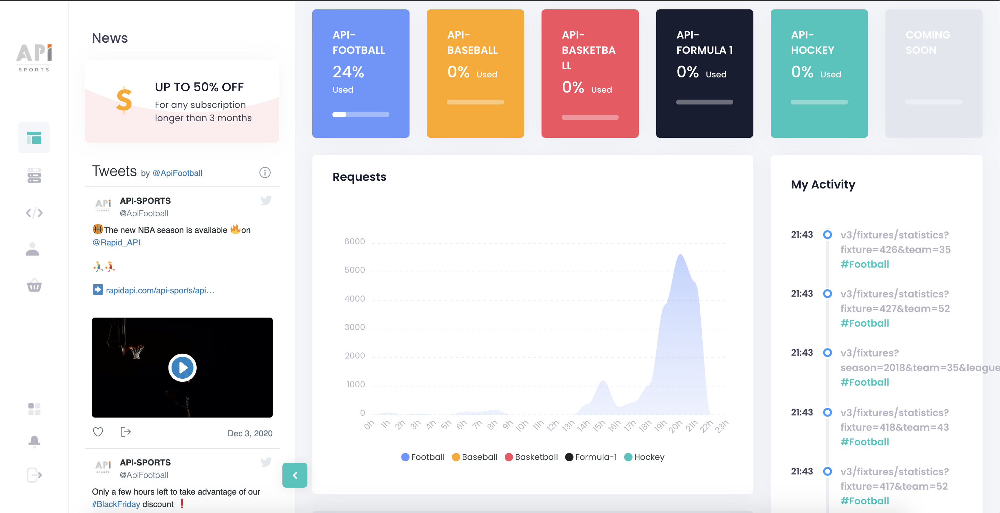

# Soccer Match Prediction with Machine Learning
## Group Project by Ryan Chiu, Santiago Calvo, Steve Sibson and Mamadou Diallo

### Overview
Our motivation in this project is to predict the results of the English premier league (EPL) fixtures with machine learning to guide a potential betting model. Once the model is up and running we will use it to predict the fixtures of any other league by changing league and team ids. A machine learning model is used in an attempt to accurately predict the outcome of a match. The core idea is to create a model that would predict the winner of any given match at a higher success rate than betting odds-makers were currently achieving. We have revamped and scaled our model with the use of a comprehensive API, improving our accuracy and reliability from our previous work.

### Features

We used API-Football to expand our model and improve accuracy. The additional features included in this project are:

- shots_on_goal
- shots_off_goal 
- total_shots
- blocked_shots
- shots_insidebox 
- shots_outsidebox
- fouls
- cornerkicks
- offsides
- possession 
- yellowcards
- redcards 
- gk_saves 
- pass_percentage 

All features are used to assess strength of home and away teams, in an effort to correctly predict the outcome of any given fixture.

### Logistic Regression Model
We selected a Logistic Regression model due to the clarity of the results. We will build, train and evaluate the model to predict team performance using historical data from the league itself. We were able to source comprehensive league data for all previous seasons in csv format. We used data from 2015 to 2018 as training data and data from 2019 season as testing data. Our model was designed to find the outcome of any given match. Results were assigned a "-1", "0" and "1" which represent loss, draw or win. Betting in English premier league matches is generally split in to “Win” or “Did not win” for the favored team, negating draws as an important factor. We tested the model using the 2019 data.

### Data Discrepencies
- We initially struggled with relegation and promotion, but with the inclusion of the API, the data is pulled weekly, diminishing the effect this has on our model's predicitions.
- The data pulled was occasionally ordered in reverse chronological order, requiring extra data cleaning. There did not seem to be any pattern as to when the data would be ordered incorrectly, requiring regular checking of the API requests.

### Notebooks
We run one master notebook, and started with the data cleaning process to get clean data presented in .JSON form by the API. We created training and testing dataframes, using data from 2015 to 2018 for training and data from 2019 for testing. The API is up to date with current fixture results and statistics, making the model adaptable and servicable for all major soccer leagues. 

